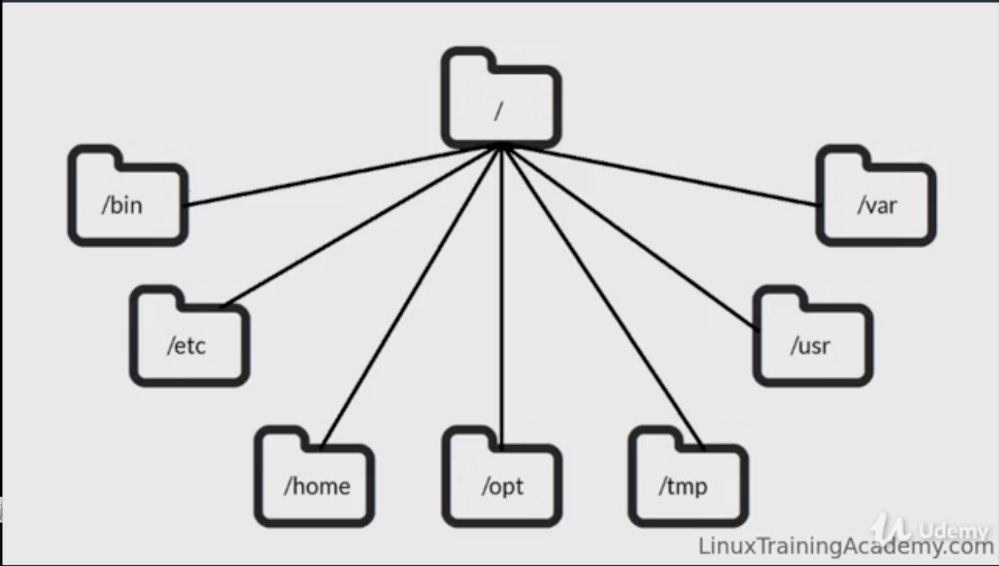
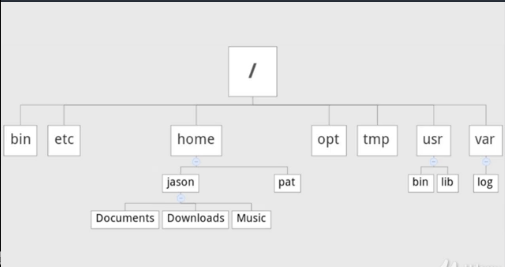
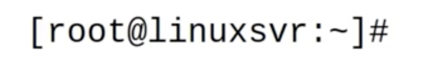
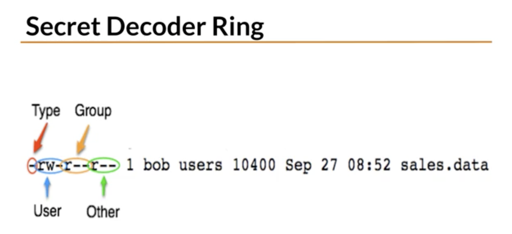
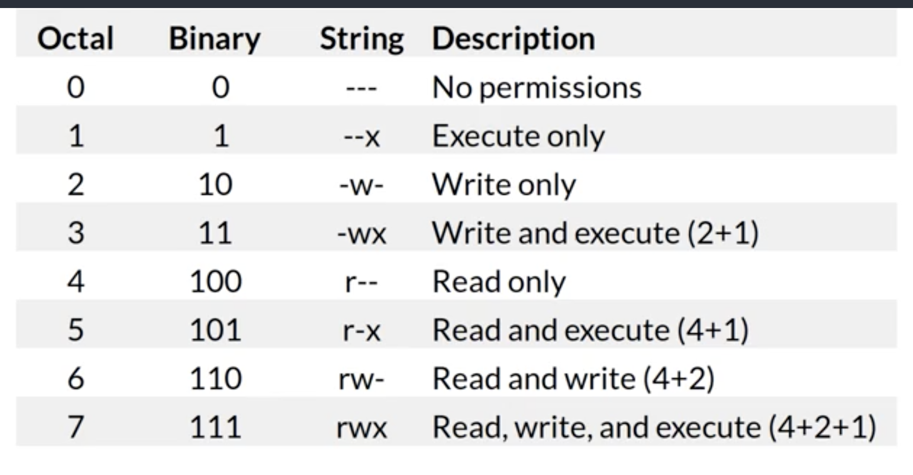
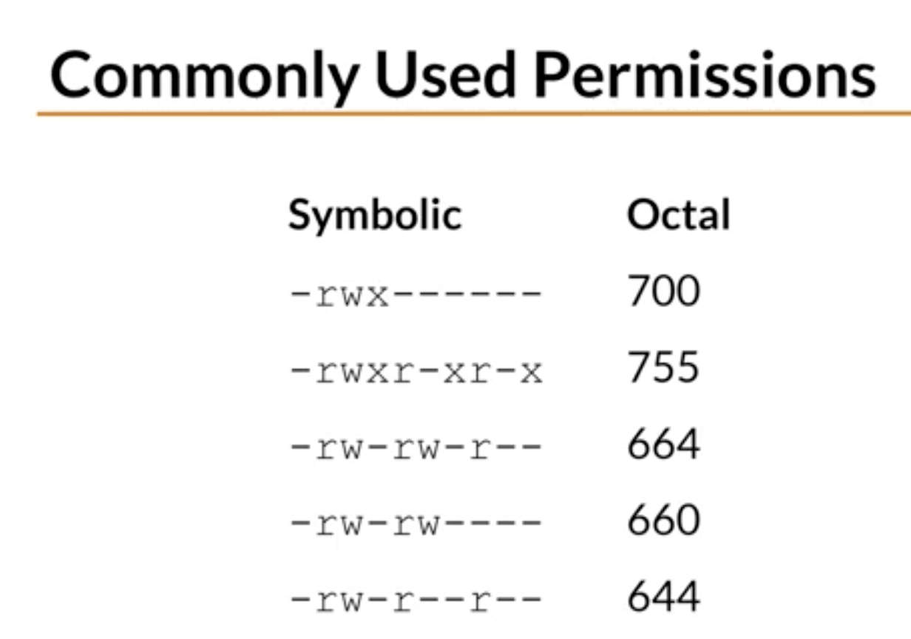
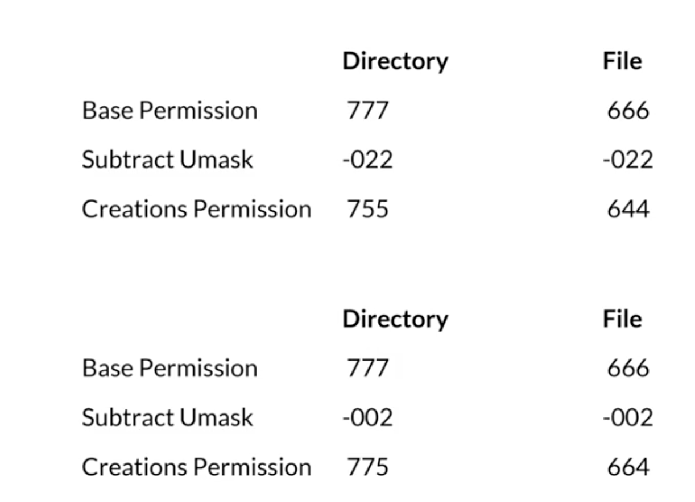
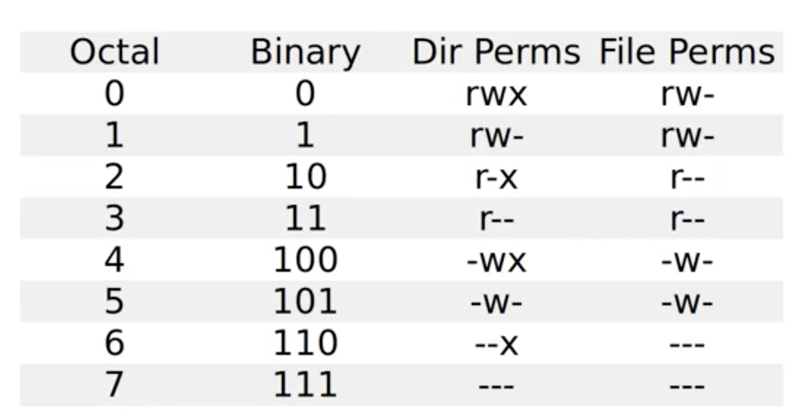
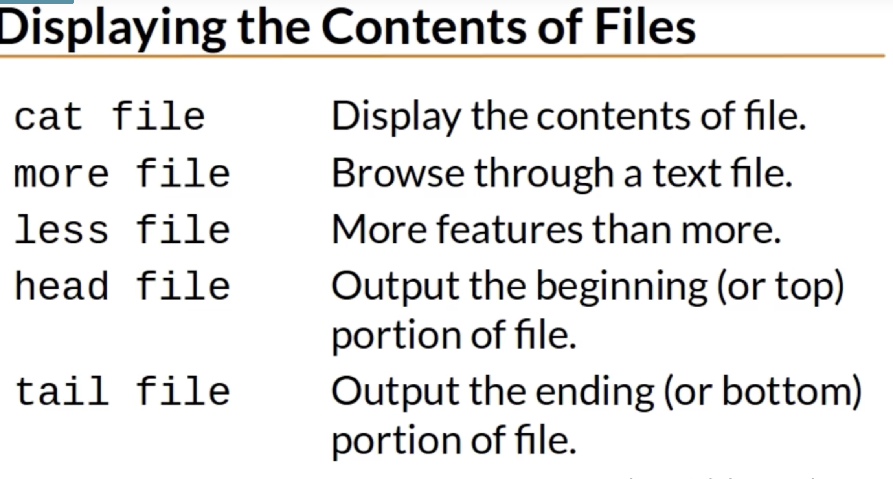
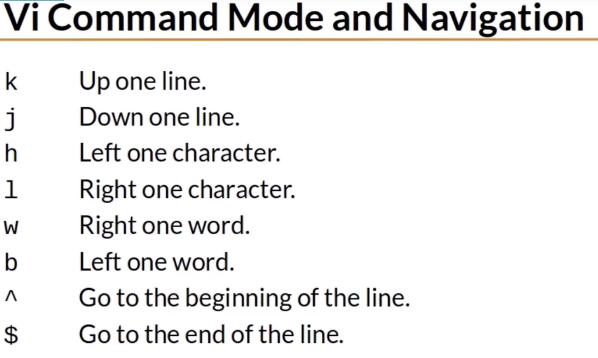

# This is a note for linux courese
# Create at 2018.05.14
<hr>

# Lecture 1:
## Linux Distribution
* Redhat
    * Banks
    * Airlines
    * ....
* Ubuntu
    * startups
    * Saas
    * Social networks..
* Linux Distro = kernel + software
*

# lecture 2:
## Common Directories
* /   "Root", the top of the file system hierarchy
* /bin  Binaries and other executable programs
* /etc  System congfiguration files
* /home Home Directories
* /opt  Optional or third party software
* /tmp  Temporary space, typically cleared on reboot
* /usr  User related programs
* /var  Variable data, most notably log files.
* path:



## Comprehensive Directory Listing:
* /boot
* /cdrom
...

## superuser / root:

* root = admin
* ~ :
    * ~root = /Root
    * ~dorothy = /home/dorothy
    * ~ftp = /srv/ftp

## Basic Linuc Commands:
* ls  => Lists directory contents
* cd  => Changes the current Directory
* pwd  => Displays the present working Directory
* cat  => Concatenates and displays (content) files
* echo  => Displays arguments to the screen
* man  => Displays the online manual
* exit  => Exits the shell or your current session.
* clear  => Clears the screen .


* ls -l :more details about the file
### environment variable:
* PATH:
    * ./command = Execute command in this dir
* OLDPWD:
### location of the full path:
* which

## Directories:
* .  => This Directory
* ..  => The parent directory
* cd -  change to the previous directory

## Creating and Removing Directories:
* mkdir [-p] directory => Create a directory
* rmdir [-p] director => Remove a directory
    * Only remove empty directory
* rm -rf directory => Recursively removes directory

## ls:
* ls -l  : show the long format
* ls -a : show the hidden files
* ls -a -l / ls -l -a / ls -al / ls -la is all the same.
* Use ls -F to reveal file types:
    * / directory
    * @ link
    * * Executable
* ls -t  : list files sorted by time
* ls -r  : reverse order
* ls -latr : long listing including all files reverse sorted by time
* ls -R  : Lists files recursively
* ls -d  : only show the directory name
* ls --color  : Colorize the output
## tree:

# Lecture 3:
## File and Directory Permission
* - : Regular file
* d : Directory
* l : Symbolic link
* r : Read
* w : Write
* x : Execute
## Permission Categories:
* u : User
* g : Group
* o : Other
* a : all

### Groups:
* Every user is in at least one group
* User can belong to many groups
* Groups are used to organize users.
* The groups command display a user's groups
    * eg: group root
* You can also use **id -Gn**.


### Changing Permission:
* chmod  : Change mode command
* ugoa  : User category; user, group, other, all
* +-=  : Add, subtract, or set permissions
* rwx  : Read, Write, Execute
* eg:
```
chmod g+w sales.data
ls -l sales.data

chmod u+rwx,g-x sales.data

chmod a=r sales.data
```

* Numeric Based Permission:

* Order Has Meaning:

* eg:
```
chmod 400 my-cat
```
* We should avoid 777 or 666 for some security concern

### Working with Groups
* New files belong to your primary group
* The _chgrp_ command changes the group.


### Directory Permissions Revisited
* **Permissions on a directory can effect the files in the directory**.
* If the file permissions look correct, start checking directory permissions.
* Work your way up to the root.

### File Creation Mask:
* File creation mask determines default permissions.
* If no mask were used permissions would be:
    * 777 for directories
    * 666 for files
* The umask Command:
    * umask [-S] [mode]
    * Sets the file creation mask to mode, if give
    * Use **-S to for symbolic notation**
    * how to use:
        
    * common umask modes:
        * 022
        * 002
        * 077
        * 007
    * 8 umask permutations:
    
    * Special Modes:
        * umask 0022 is the same as umask 022
        * chmod 0644 is the same as chmod 644
        * The special modes are :
            * setuid
            * setgid
            * sticky
        * **touch** either create a file if not exist, or update the timestamp of the file

## Displaying the Content of File:
* displaying content:
    

* head: first 10 lines
* tail: last 10 lines
* tail -1 file.txt: only last line
* tail -f file.txt: view as the file grows, eg log file.

## Nano Editor:
easiler than vi..

## Vi Editor:
* cheat sheet:

* turn on line numbering:
   ```
    :set nu
   ```
* turn off line numbering:
    ```
    :set nonu

    ```
* Repeating command: <number><command>:
    * 5k: move up a line 5 times
    * 80i<Text><ESC> = Insert <Text> 80 times
    * 80i_<ESC> = Insert 90 "_" characters.

* Deleting Text:
    * x Delete a character
    * dw Delete a word 
    * dd Delete a line
    * D Delete from the current position.

* Changing Text:
    * r Replace the current character
    * cw Change the current word.
    * cc Change the current line 
    * c$ CHange the text from the current position.
    * C Same as C$
    * ~ Reverses the case of a character
    
* Copying and Pasting
    * yy Yank(copy) the current line
    * y<position> Yank the <position>
    * p Paste the most recent deleted or yanked text.

* Undo and Redo:
    * u Undo
    * Ctrl-R Redo


* Searching:
    * /<pattern> Start a forward searching 
    * ?<pattern> Start a reverse searching


## Emacs Editor
* 

## Find File:
* find [path..] [expression]
    * Options:
        * -name pattern  Find files and directories that match pattern.
        * -iname pattern  Like -name, but ignore case.
        * -ls  Performs an ls on each of the found items. (eg: find / README.md -ls)
        * -mtime days  Find files that are days old.
        * -size num  FInds file that are of size num.
        * -newer file  Find files that are newer than  file.
        * -exec command {}\;   Run command against all the files that are found. (eg: find . -exec file {} \;)

## sort
* sort file
    * Options
        * -k F  Sort by key. F is the field number (eg, sort -u -k2 filename)
        * -r  Sort in reverse order
        * -u  Sort unique.
 
## Creating a collection of Files
* tar [-] c|x|t f tarfile [pattern]  Create, extract or list contents of a tar archive using pattern, if supplied.
    * Options
        * c  Create a tar archive
        * x  Extract files from the archive
        * t  Display the table of contents(list)
        * v  Be verbose
        * z  Use compression
        * f file   Use this file

## Compressing Files to Save Space
* gzip  Compress files.
* gunzip  Uncompress files
* gzcat  Concatenates compressed files
* zcat  Concatenates compressed files.

## Disk Usage
* du  Estimates file usage
* du -k  Display sizes in Kilobytes
* du -h  Display sizes in human readable format.


## Wildcards
* "*"  matches zero or more characters
* ?   matches exactly one character*
* []  A character class. (eg, ca[nt]?)
* [!]  Matches any of the characters NOT included between the brackets. Matches exactly one character. (eg, [!aeiou])
* Use two characters separated by a hyphen to create a range in a character class.(eg, [a-g])
* Named Character Classes
    * [[:alpha:]] matches alphabetic letters. (Both lower and upper cases)
    * [[:alnum:]] matches alphanumeric letters. (Any upper or lower  and digit)
    * [[:digit:]] 
    * [[:lower:]]
    * [[:space:]] white space.
    * [[:upper:]]

* Matching Wildcard patterns
    * \  escpae character. Use if you want to match a wildcard character.
        * match all files that end with a question mark:
            * "*\?"
            
## Redirection
* >  Redirects standard output to a file. Overwrites (truncating) existing contents. 
* >>  Redirects standard output to a file. Appends to any existing contents.
* <  Redirects input from a file to a command.
* &  Used with redirection to signal that a file descriptor is being used.
* 2>&1  Combine stderr and standard output.
* 2>file  Redirect standard error to a file.
* >/dev/null  Redirect output to nowhere


## Comparing the contents of Files
* diff file1 file2  Compare two files.
* sdiff file1 file2  Side-by-side comparison.
* vimdiff file1 file2  Highlight differences in vim.
    * output: eg. 3c3; where the first "3" is the line number of first file, and so as the second "3".
    * LineNumFile1 - Action - LineNumFile2
        * Action = (A)dd(C)hange(D)elete
    * in vimdiff: 
        * ctrl-w w   Go to the next window
        * :q    Quit current window
        * :qa   Quit all

## Searching in FIles and Using Pipes
* grep  Display lines matching a pattern
    * grep pattern file
        * Options
            * -i  Perform a search, ignoring case.
            * -c  Count the number of occurrences in a file
            * -n  Precede output with line numbers.
            * -v  Invert Match. Print lines that don't match.

* file  file_name  Display the file type.

* strings  Display printable strings
* |    Pipe symbool
    * command-output  |  command-input
    * eg.  cat file | grep patter

* cut [file]   Cut out selected portions of file. If file is omitted, use standard input.
    * Options
        * -d delimiter  Use delimiter as the field separator
        * -f N  Display the Nth field.
        * eg. cut -d' ' -f2,5
* tr  Translate character. (eg, tr ":" " "  translate ":" to " "
* column -t   Show in table format


## Copying FIles over the Network
* SCP - Secure copy
* SFTP - SSH file transfer protocol

* scp source destination   Copy source to destination
* sftp host      Start a secure file transfer session with host.
* ftp           Start a file transfer session with host.


